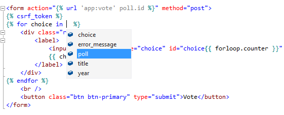
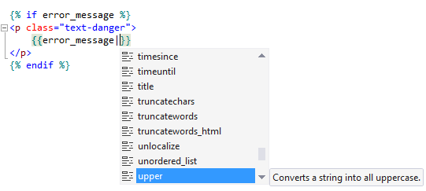
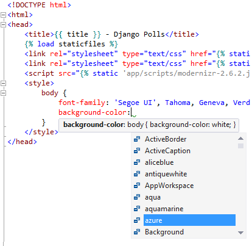
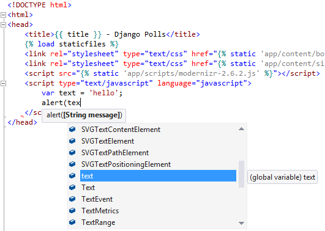
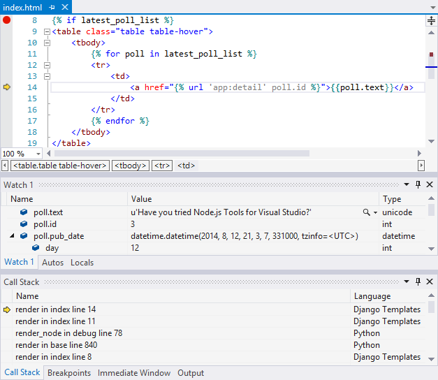
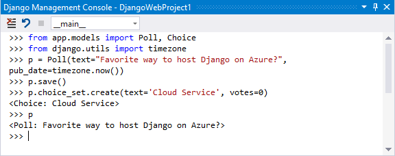
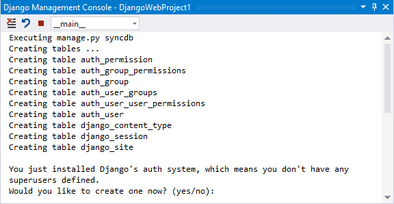
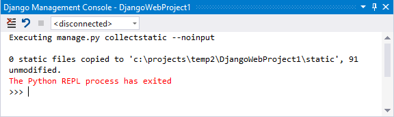
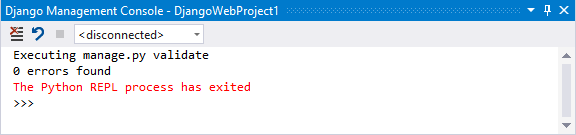

Django
======

This section provides an overview of features specific to Django web projects in Visual Studio.

Template Editing
----------------

### IntelliSense

The Django template editor understands the context variables passed into the 
template and makes them available as completions.

Django tags and filters (builtins and user defined) are also available.

### Embedded CSS IntelliSense (VS 2013 Only)

In [PTVS 2.1](https://pytools.codeplex.com/releases/view/109707), syntax coloring and IntelliSense is now available for embedded 
CSS.

### Embedded JavaScript IntelliSense (VS 2013 Only)

In [PTVS 2.1](https://pytools.codeplex.com/releases/view/109707), syntax coloring and IntelliSense is now available for embedded 
JavaScript.

Template Debugging
------------------

[wiki:"Standard debugging features" Features Debugging] such as Breakpoints, 
Stepping and Inspecting values are available for Django templates.

Django Management Console
-------------------------

### Django Shell

The **Open Django Shell** from the **Project** menu or solution explorer 
**Python** context menu opens a shell in your application context which 
enables you to manipulate your models.

### Sync DB

The **Django Sync DB** from the **Project** menu or solution explorer 
**Python** context menu executes `manage.py syncdb`.

### Collect Static

The **Collect Static Files** from the **Project** menu or solution explorer 
**Python** context menu executes `manage.py collectstatic --noinput`.

This copies all the static files to the path specified by **STATIC_ROOT** in 
your **settings.py**.

### Validate

The **Validate Django App** from the **Project** menu or solution explorer 
**Python** context menu executes `manage.py validate`.

This will report any validation errors in the installed models specified by 
**INSTALLED_APPS** in your **settings.py**.

Microsoft Azure
---------------

### Publishing

When [wiki:"publishing to Microsoft Azure" Features Web Project#publishing-to-microsoft-azure], 
static files are automatically collected as part of the publish operation.

### Tutorials

See the following tutorials for examples of using PTVS to create Django applications for Microsoft Azure.

 * [wiki:"Django and SQL Database on Azure" PollsDjangoSql]
 * [wiki:"Django and MySQL on Azure" PollsDjangoMySql]
