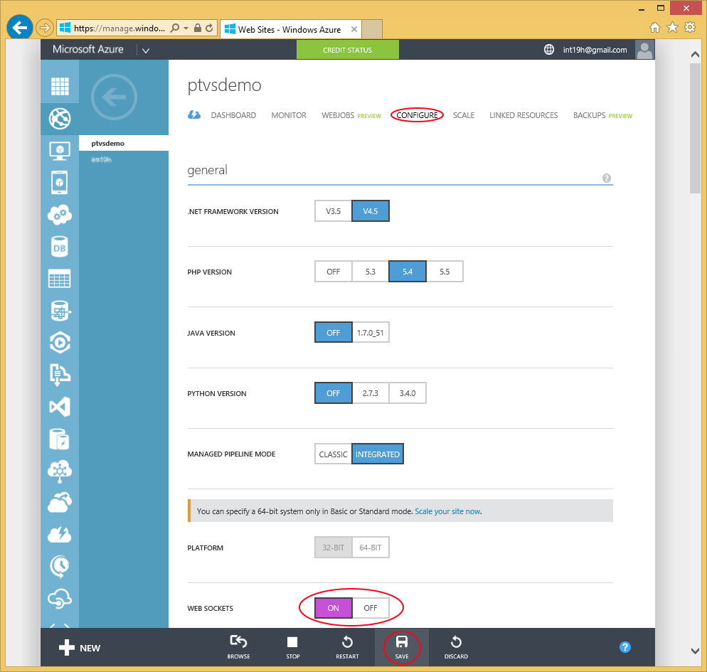
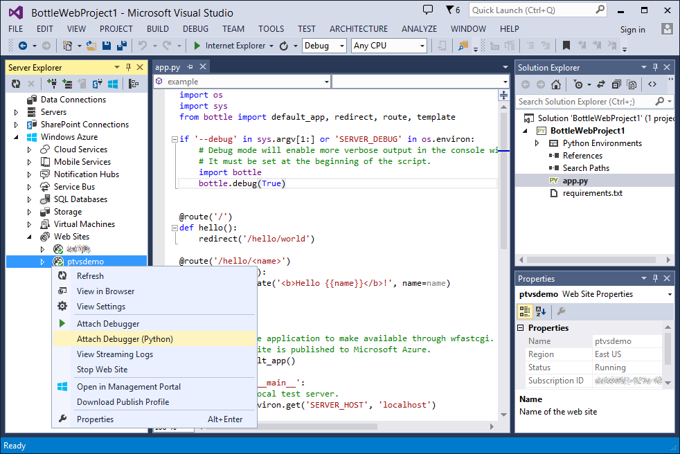
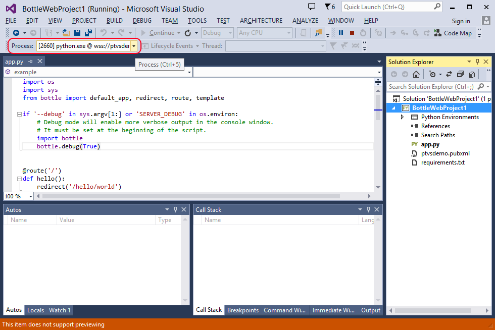
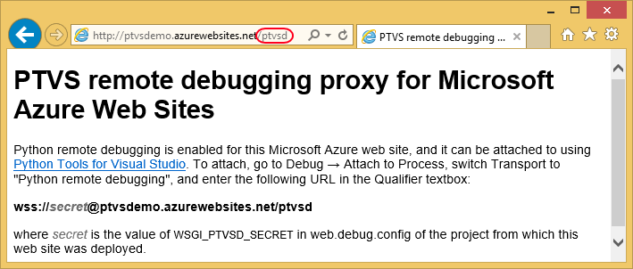
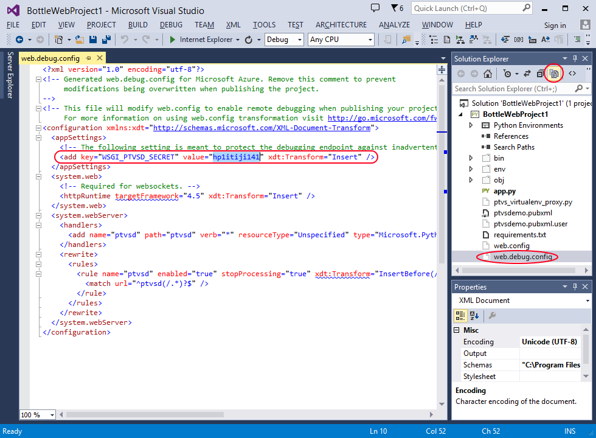
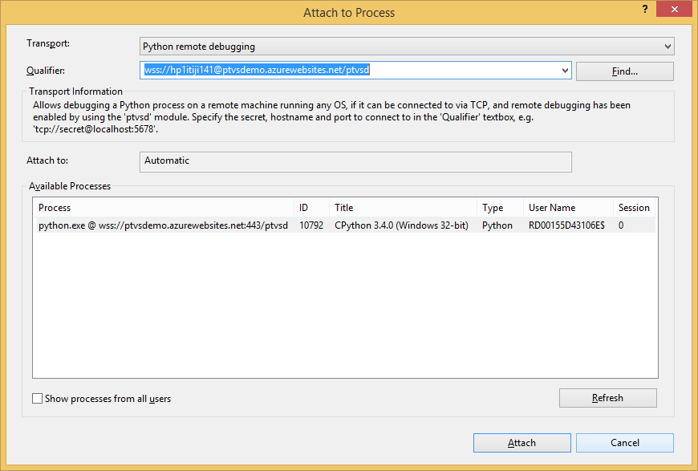

Remote Debugging on Microsoft Azure
===================================

Python Tools has special support for remote debugging of code running on Microsoft Azure Web Sites. Unlike simple remote debugging, the target machine is not directly accessible over TCP in this scenario, but PTVS comes with a WebSocket proxy for the debugging protocol that exposes the debugger protocol via HTTP. When you create a new Microsoft Azure project, the proxy is fully configured for you in an automatically generated web.debug.config, and will be enabled on the web site if you publish your project in the "Debug" configuration by following [wiki:"these steps" Features Web Project#publishing-to-microsoft-azure].

Since the Azure remote debugging uses web sockets, it must be enabled for your web site in the management portal. This setting can be found on the web site management page, on the "Configure" tab - don't forget to click "Save" after changing it:

Once your project is properly deployed and web sockets are enabled, you can attach to the web site from Server Explorer. If you do not have the Server Explorer window open, you can open it via View → Server Explorer. Then, locate your web site under Microsoft Azure → Web Sites, and right-click on it. If it is running, and your project has been deployed to it using the Debug configuration, you should see the "Attach Debugger (Python)" command in the context menu:

Note that on Visual Studio Professional and above, you will see two "Attach Debugger" commands - the default one with no qualifiers is used to debug .NET applications running under IIS, and is only useful if you co-host .NET code alongside your Python app. To attach to your Python app, you need to use the "Attach Debugger (Python)" command. If you do not see that command in the context menu for your site (i.e. you only see "Attach Debugger", or you see neither), then one of the following applies:

* You do not have Visual Studio 2013:
 * Server Explorer functionality is not available on your version of Visual Studio. You will have to use attach via Attach to Process dialog as described [below](#attaching-without-server-explorer).
* You do not have Visual Studio 2013 Update 2 or later installed:
 * Download and install [Update 2](http://www.microsoft.com/en-us/download/details.aspx?id=42666). 
* The project is not opened in Solution Explorer:
 * Open the project that you're trying to debug via File → Open → Project/Solution.
* The web site is not running (i.e. stopped - this can be seen from its icon):
 * Start the web site by right-clicking on it in Server Explorer and selecting "Start Web Site" in the context menu.
* The project was not deployed in the "Debug" configuration:
 * Re-deploy the project in "Debug" configuration as described [wiki:"here" Features Web Project#publishing-to-microsoft-azure].
* web.debug.config was modified to disable the debug proxy.
 * Restore the original web.debug.config. The easiest way to do so is to delete it, which will cause it to be recreated with default settings on the next publish.

If the attach has completed successfully, Visual Studio should switch to debug window profile, and the title bar should say "(Running)" after the opened project name. You should also be seeing the debugger toolbar, which indicates the process being debugged - for a Microsoft Azure web site, it should include a corresponding wss:// URI:

Once attached, the debugging experience is mostly the same as for regular remote debugging. However, there are some constraints placed by the execution environment. In particular, IIS web server that handles incoming requests and delegates them to Python code via FastCGI has a timeout for request handling, which defaults to 90 seconds. If request handling takes longer than that (for example, because of the process being paused at a breakpoint), IIS will terminate the process, which will immediately end your debugging session. 

## Attaching without Server Explorer

It is also possible to attach to a Microsoft Azure web site directly from the Attach to Process dialog, similar to regular remote debugging. A brief guide on how to do so can be found on the WebSocket proxy info page, which can be found on your web site under /ptvsd - this can also be used to verify that the proxy is up and running:

First of all, you will need to determine the auto-generated ptvsd secret for your website - it is defined in web.debug.config in your project, and is regenerated every time the project is published (unless the comment at the top of web.debug.config is removed to suppress its regeneration). You may need to enable "Show All Files" in Solution Explorer to locate web.debug.config, if you haven't previously included it into your project. Once you open the file, look for an appSetting named "WSGI_PTVSD_SECRET", and note its value:

Once you know the secret, you can construct the debugger proxy endpoint URI. For example, given a web site at **http://ptvsdemo.azurewebsites.net**, and the secret as specified on the screenshot above, the proxy is at **wss**://**hp1itiji141**@ptvsdemo.azurewebsites.net/**ptvsd**.  

Now, to attach to the debugger using that URL, open Debug → Attach to Process, select "Python remote debugging" in Transport dropdown, enter the **wss://** URL into the Qualifier textbox, and press Enter. If PTVS can successfully connect to the web site, it will show a single python.exe process in the process list below the qualifier. Press Enter or click "Attach" to attach to that process.

