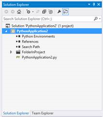
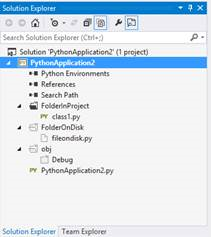
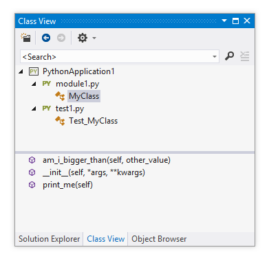
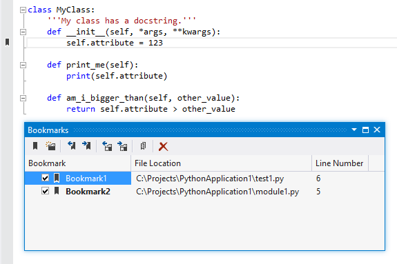

Browsing your Code
==================

Visual Studio provides a number of ways to navigate around your projects, and PTVS allows you to take advantage of these with Python projects.

--(

>>

Solution Explorer
-----------------

The Solution Explorer window shows the files included in your project (see [wiki:"Projects" Features Projects] for an overview of project files). You can double-click any of these files to open them in the associated editor, and files can be moved, copied, renamed, or deleted. Because Python projects are required to match the file structure on disk, any changes made though Solution Explorer will also occur on disk.

Solution Explorer also includes the [wiki:Python Environments] node, the Search Paths node, and the [wiki:"References" Features Projects#references] node.

By default, Solution Explorer is visible and docked to one side of the main Visual Studio window. To show the window again, you can click on View -> Solution Explorer. Depending on your settings, the keyboard shortcut may be Ctrl+Alt+L, or Ctrl+W followed by S.

--)

### Show All Files

When using Solution Explorer to view project files you have the option to view files only in the project, or all files that are on disk. This behavior is controlled by the "Show All Files" button on the Solution Explorer toolbar. When enabled, "Show All Files" will display all the files on disk, regardless of whether they are included in the project or not. Disabling "Show All Files" will show only those files and folders included in the project.

It is important to remember that files that are not part of the project will not be scanned by the analysis engine and may not be deployed to a remote server. Files not included in the project show as a dotted line icon. Files or folders on disk can be added to the project by right clicking and selecting "Include in Project". Adding or removing a folder to the project will add or remove all of its children.

--(

<strong>Disabled</strong>

<strong>Enabled</strong>

--)

--(

>>

Class View
----------

The Class View window shows a flat view of the modules in your project, and lets you expand them to view classes. Selecting a class will list its members in the lower part of the window, and double clicking on any item will take you to its definition in code.

To show the Class View window, click View -> Class View. Depending on your settings, the keyboard shortcut may be Ctrl+Shift+C, or Ctrl+W followed by C.

--)

Object Browser
--------------

The Object Browser is similar to the ClassView, but also displays information about the selected item in a panel in the lower-right. It has a less compact layout and is better suited to being placed in the main part of the window, rather than docked to one side.

To show the Object Browser window, click View -> Object Browser. Depending on your settings, the keyboard shortcut may be Ctrl+Alt+J, or Ctrl+W followed by J.

--(

>>

Navigate To
-----------

Navigate To provides a quick way to search for any element in your project. Using the same fuzzy search as [wiki:"IntelliSense" Features Editor#intellisense], you can find modules, classes, functions, and module- or class-scoped variables. Type a few letters matching the name of the item you want, use the arrow keys to select the right one, and press Enter to display it in the editor.

To access Navigate To, click Edit -> Navigate To. The keyboard shortcut is typically Ctrl+, (comma).

--)

Bookmarks
---------

Bookmarks allow you to add markers on particular lines of code so you can easily return to them. Under the Edit -> Bookmarks menu are commands for adding, removing, and navigating between bookmarks. There is also a Bookmark Window that lists all of the bookmarks in all open projects, allowing you to double-click on the one you want to view. Bookmarks can be renamed through this window.

To show the Bookmark Window, click View -> Bookmark Window. Depending on your settings, the keyboard shortcut may be Ctrl+K followed by Ctrl+W, or Ctrl+W followed by B. Check the Edit -> Bookmarks menu for the shortcuts to add, remove, and navigate between bookmarks.
