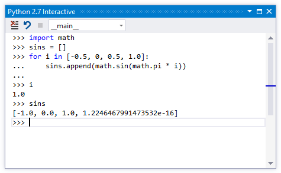
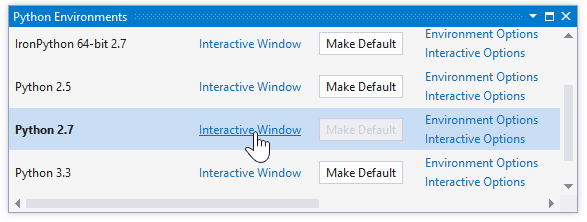
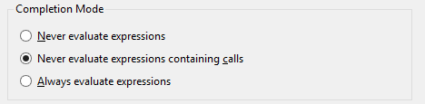

Working with the Interactive Window
===================================

Python Tools for Visual Studio includes interactive windows for each of your installed environments. Also known as REPL (Read/Evaluate/Print Loop) windows, these allow you to enter Python code and see the results immediately. You can use all modules, syntax and variables, just like in a Python script.

To open an interactive window, bring up the Python Environments window (Ctrl+K, Ctrl+backtick, or Tools, Python Tools, Python Environments) and click "Interactive Window" for the environment you want to use. Alternatively, the same links are available through View, Other Windows, or through Tools, Python Tools.

The interactive window supports executing files or the start file of your project. The text of the menu item will change depending on if you have a project opened or not. When in a project the command will be called "Execute Project in Python Interactive". When you have a file that is not part of a project, the command will be "Execute File in Python Interactive":

As well as the built-in Interactive window, you can choose to use IPython if you have it installed. IPython is an advanced yet user-friendly interactive development environment that's cross-platform and has Interactive Parallel Computing features (discussed elsewhere). See [wiki:Using IPython with PTVS] for more information.

Switching Scopes
----------------

The interactive window when initially started is in the scope for the main module. If you bring up the interactive window without starting a file, the module is empty. If you start a file or your project, the module contents is the starting file, as if you ran it from the command prompt. You can also view other scopes which contain user code and switch amongst them to execute code within those modules. For example, after typing "import os" a number of modules execute, and you can now switch between them using the File Scope drop down. 

Selecting a module changes the current scope, and input now executes in that module. Whenever you perform any actions such as switching scopes, a log message is written to the output window, so you can keep track of how you got to a certain state during your development. 

The interactive window also supports several meta commands. All meta commands start with a $, and you can type $ or $help to get a list of the meta commands. The most useful meta command is probably the command that switches between modules without using the drop down box. This command is the $mod command and is followed by the module name you'd like to switch to. Other commands include clearing the screen, running a file which can include $ commands as well, or resetting the interactive process. The commands are also extensible via MEF (the Managed Extensibility Framework for .NET).

Code Completions
----------------

The interactive window includes IntelliSense based on the live objects rather than the source code analysis, unlike the code editor where only source code analysis is used. The main benefit of this is that the suggestions are always more correct in the interactive window, especially when code is being dynamically generated. The drawback is that functions which have side effects may impact your development experience, for example, logging messages may interrupt your typing. If this is a problem, you can modify the behavior.

Interactive options are available through the Python Environments window, or through Tools, Options, Python Tools, Interactive Options. To control whether suggestions in the interactive window are found by executing code and optionally, by calling functions, you can change the Completion Mode.

If "Never evaluate expressions" is selected, the normal IntelliSense engine will be used for suggestions. If "Never evaluate expressions containing calls" is selected, simple expressions such as "a.b" will be evaluated but expressions involving calls, such as "a().b", will use the normal engine. Finally, "Always evaluate expressions" will execute the complete expression to get suggestions, regardless of whether it may have side-effects.

<a id="SendTo" />
Sending Code to Interactive
---------------------------

In addition to working within the interactive window there are commands available that send selected code from the editor to the interactive window. This lets you work within the interactive window, update code in the editor, and then quickly send the updated code to the interactive window. 

In addition to simply sending the code to the current scope in the interactive window there is also a separate command which sends the code to the defining module. This command will search the interactive process to find the module that matches the current file being edited. If the command finds the correct module, then it uses the $module command to switch to that module. The $module command becomes part of the history of the interactive window so that the interactive buffer remains as a comprehensive history of everything you've done. Then the command pastes the selection into the interactive window for evaluation. 

The end result of this in the interactive window is indistinguishable from if you had manually switched to the correct scope and pasted the text yourself.

