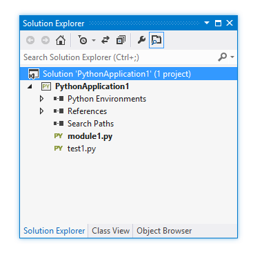
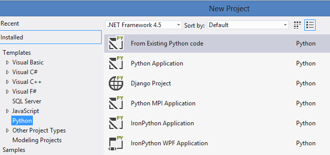
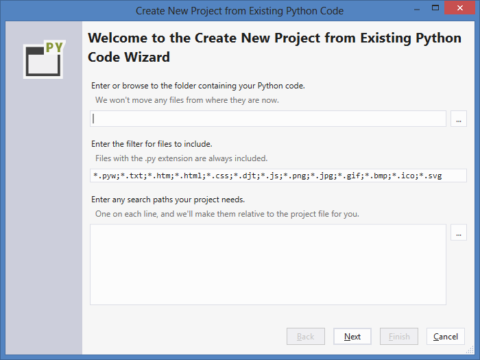
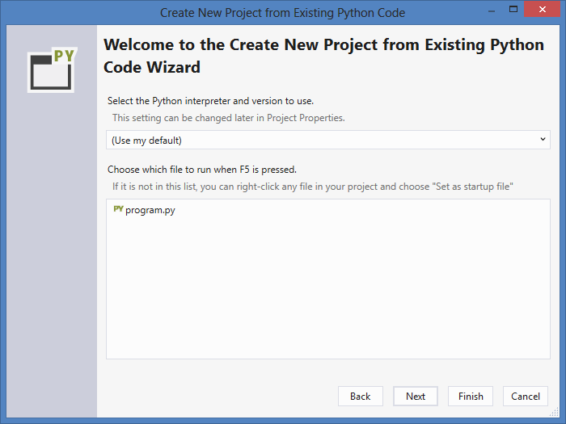
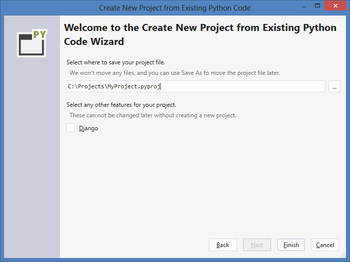
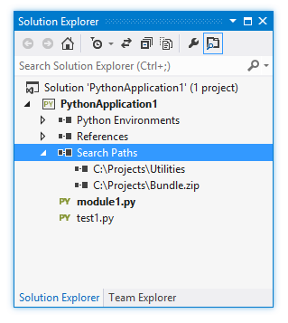
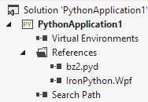
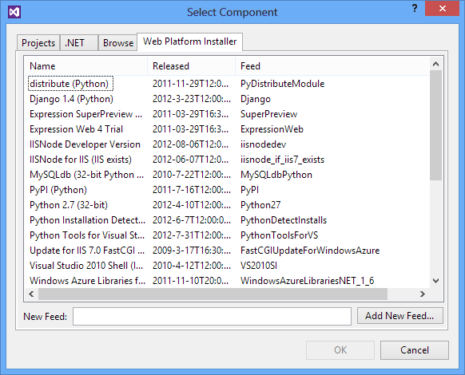

Projects
========

--(

>>

Python Tools allows you to create projects using the Visual Studio project system. Project files (.pyproj) reference all the source and content files associated with your project, showing them all in the Solution Explorer window and enabling PTVS to most efficiently work with your files.

Like all Visual Studio languages, Python project files are referenced from a solution. Solutions can contain multiple projects, including of different types, and projects can include references to each other. For example, a Python project may include a reference to a C++ project for an extension module. When you start debugging, the C++ project will build (if necessary) before the Python project runs.

Projects include a start-up file, which will run when you start with debugging (F5) or execute your project in the interactive window (Shift+Alt+F5). This file is bolded in Solution Explorer. You can change the startup file by right-clicking and selecting "Set as Startup File" on the file you want to start with.

Each project may be associated with one or more Python environments, and may include virtual environments. See the [wiki:Python Environments] page for more information on modifying these settings.

--)

Project Types
-------------

### Python Application

This is a basic application that is a good starting point for any Python project. With the default settings, your project will run and be debugged with the console interpreter (typically `python.exe`) of your default environment. After creation, you can choose another environment or create a virtual environment, add new modules and packages, choose to run with the windowed interpreter (`pythonw.exe`), or use mixed-mode (C++/Python) debugging.

### Django Web Project

This project is based on the standard Django template.
You can add new apps to the project, create virtual environments, edit page templates, interactively debug both code and template files, and publish to Windows Azure.
See our [Django tutorial](http://www.windowsazure.com/en-us/develop/python/tutorials/django-with-python-tools-for-visual-studio-20/) for a walkthrough on creating and deploying a Django project.

### Other Web Projects (Bottle, Flask, etc.)

These projects are web servers using various frameworks.
See the [wiki:"Web Projects" Features Web Project] documentation for more details.

### Python MPI Application

(Only available when the HPC components are installed - see our [wiki:"installation" PTVS Installation] page for the required dependencies).

This project provides a basic outline and deployment settings for an MPI application to run in a cluster.

### IronPython Application

Similar to the Python application, this project is a good starting point for projects using IronPython and interacting with .NET code. By default, it will use mixed-mode IronPython/managed debugging and run with the 32-bit IronPython interpreter.

### IronPython WPF Application

Windows Presentation Foundation applications use XAML files to describe rich user interfaces, and Visual Studio includes a drag and drop designer for WPF windows. With IronPython, the code behind the UI can be written with Python. By default, this project will use a 32-bit IronPython interpreter, mixed-mode IronPython/managed debugging, and run without displaying a console (`ipyw.exe`).

### IronPython Silverlight Web Page

This is an IronPython application which will run in the web browser using Silverlight. The code is written in a .py file included in a web page using `<script type="text/python" src="..."></script>`. A boilerplate script tag pulls down some JavaScript code which initializes IronPython running inside of Silverlight. From there your Python code can interact with the DOM. (Note: Silverlight support is very preliminary.)

### IronPython Windows Forms Application

Windows Forms applications use an older windowing framework, where controls are created and positioned using code. PTVS does not include a designer for Windows Forms applications, and so all UI must be written in Python. By default, this project will use a 32-bit IronPython interpreter, mixed-mode IronPython/managed debugging, and run without displaying a console (`ipyw.exe`).

<p id="ProjectFree" />
Lightweight Usage Project-free
------------------------------

Python Tools also supports editing your code without a project system. You can open any file on disk and start editing it immediately with code completions and debugging. There are, however, some important caveats that only apply when not using a project:

* All files and packages in the same directory will be analyzed; if there are a lot of files, this may consume a lot of CPU
* Without a project, you will always use the global default environment; you may see incorrect completions or errors if the files are meant for a different version of Python.
* To run the file, you must right-click in the editor and select "Start with Debugging" or "Start without Debugging" (the F5 keyboard shortcuts are disabled). This will use your global default environment; in a project you can select the environment to use.

To quickly create a project from a directory of existing code, see [Create Project from Existing Files](#create-project-from-existing-files).

<p id="NewProjectFromExisting" />
Create Project from Existing Files
----------------------------------

If you already have existing Python code, you can easily create a new project without having to move it around. In the New Project window select "From Existing Python Code":



This will display the following wizard, where you can choose the path containing your existing code, a filter to include specific file types, and any search paths that your project requires.



On the next page, you can choose the environment to associate with this project and the file to run when you press F5. (Only files in the root of the folder tree are shown, so if the one you want is not there, don't choose anything for now and set it later.)



On the final page, you can select the location to save the project file. Choosing another location does not move or copy the original source files, so if you want a copy you should make one before starting the wizard. There is also an option to make the project a Django project, which can only be done when the project is first created. Selecting this will enable the publishing and debugging features that are not normally available for



Click Finish and your project will be created. If you want to move the .pyproj file somewhere else at this point, select it in Solution Explorer and choose 'File->Save As'. Moving the .pyproj this way will update the file references, so we don't have to copy any code files around, but adds, deletes, and renames will affect the original files.

Linked Files
------------

--(

>>

Linked files appear in Solution Explorer as normal files with a shortcut icon overlayed on top of them. Linked files can exist either at the top-level of the project or embedded within an arbitrary folder structure.

--)

Linked files are specified in the .pyproj file using the normal `<Compile Include="...">` tag. They can be implicit linked files if they use a relative path outside of the directory structure or they can be explicit link files by specifying their path within Solution Explorer:

```
<Compile Include="..\test2.py">
    <Link>X\test2.py</Link>
</Compile>
```

Linked files specified in a project file will be ignored under the following conditions:

* The linked file contains Link metadata and the path specified in the Include attribute lives within the project directory, or
* The linked file duplicates a file which exists within the project hierarchy, or
* The linked file contains Link metadata and the Link path is a relative path outside of the project hierarchy, or
* The link path is rooted

### Working with Linked Files

To add an existing item as a link, use the Project->Add Existing Item menu (or the context menu), select a file, and choose "Add as Link" from the drop down on the Add button. As long as there are no conflicting files, this will create a link in the folder selected in Solution Explorer. If there is already a file with the same name, or if a link to the file is already in the project, the link will not be added.

Because you can't add a link to a file that is already within the project hierarchy, such a file will be added to the project in the correct location as a normal file instead of a link.

To convert a file into a link, use File->Save As to save the file to a location outside of the project hierarchy. It will be automatically converted to a link. Similarly, a link can be converted back by using File->Save As to save the file somewhere within the project hierarchy. The file will appear in Solution Explorer in the same location it exists on disk; files in a project must match their actual location.

If you move a linked file in Solution Explorer, the link will be moved but the actual file is unaffected. Similarly, deleting a link will remove the link without affecting the file. Linked files cannot be renamed.

Search Paths
------------

--(

>>

It is often surprising that the value of `PYTHONPATH` (or `IRONPYTHONPATH`, etc.) is ignored by PTVS, even when it has been set for the entire system. This is deliberate, and is primarily *because* it has been set for the entire system. Are the referenced modules meant for Python 2.7 or Python 3.3? Are they going to override standard library modules? Is the developer aware of this or is it a malicious hijacking attempt? Because these questions cannot be answered automatically, the system-wide value is ignored.

The equivalent behavior can be obtained in PTVS using Search Paths. These are project-specific, and will be passed as the value of `PYTHONPATH` (or equivalent) when you debug or execute your script from Visual Studio. Further, by adding the path to Search Paths, PTVS will inspect the available code and provide editor completions.


To add a search path, right-click on the Search Paths item in Solution Explorer and select "Add Folder to Search Path...". Select the folder to include and you are done. 

Files with a `.zip` or `.egg` extension can also be added as search paths by selecting "Add Zip Archive to Search Path...". As with folders, the contents of these files will be scanned and made available in the editor.

Note that any search paths added will be used for any environment associated with the project. It is possible to add a search path to Python 2.7 modules while you are using Python 3.3, and you may see errors as a result.

Depending on the number of files in the folder or file, it may take some time before completions become available. If you are regularly using the same search paths and the contents does not often change, it may be more efficient to install it into your site-packages folder. Then it will be analyzed and stored in your completion DB, will always be associated with the intended environment, and will not require a search path to be added for each project.

--)

References
----------



Visual Studio projects support adding references to projects and extensions. Typically they indicate dependencies between projects and are used to provide IntelliSense at design time or linking at compile time. Python Tools for Visual Studio also uses references in a similar fashion, but due to the dynamic nature of Python they are primarly used at design time to provide improved IntelliSense.They can also be used for deployment to Windows Azure to install additional dependencies.

### Extension Modules

A reference to a .pyd file enables IntelliSense against the generated module. These references point directly at the .pyd file which you'd like to have completions for. The .pyd file will be loaded into the Python interpreter and the types and functions will be introspected. PTVS will attempt to parse the doc strings for functions to provide signature help. If the extension module is updated on disk PTVS will re-analyze the module in the background.

This has no effect on runtime behavior - the only impact is on what completions are available. You may also need to add a Search Path to the folder containing the module.

### .NET Projects

When working with IronPython you can add references to .NET assemblies. This could be a .NET project which is part of your solution, but it can also be a .DLL that you've downloaded and want to use with IronPython.

To enable IntelliSense against a project you can right click on the References node in your Python project, select Add Reference, and then choose either the Projects or Browse tab. The Projects tab will enable you to add a reference to a C# or VB.NET project in your solution. The Browse tab will allow you to select any DLL on disk and add a reference to it.

Because in IronPython references are not available until a call to `clr.AddReference('AssemblyName')` you will also need to add a clr.AddReference call to the assembly. The reference inside of Visual Studio will ensure that PTVS can find the assembly and provide completions for it.

### WebPI Projects



You can also add references to WebPI product entries. This is currently used only for deployment to Windows Azure Cloud Service where you can install additional components via the WebPI feed. By default, the feed displayed is Python specific and includes Django, CPython, and other core components. You can also select your own feed.

When publishing to Windows Azure a setup task will run which will install all of the referenced products.
