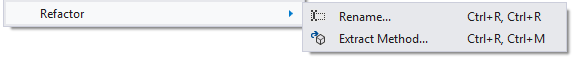
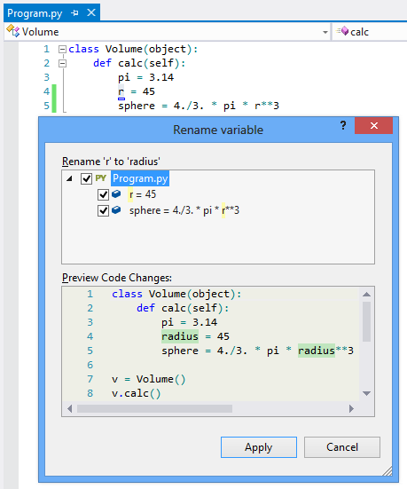
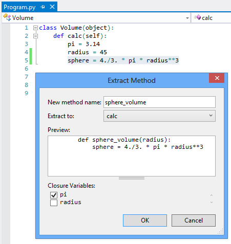
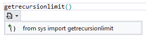

Refactoring
===========

PTVS supports several different refactorings which provide automatic transformations to your source code. This includes the [Refactory->Rename](#rename-variable) command which renames a method or variable name, the [Extract method](#extract-method) command which creates a new method, the [Add Import](#add-import) command which provides a smart tag to add a missing import, and the [remove imports](#remove-imports) refactoring which removes unused imports.

Rename Variable
---------------

To rename a variable, class, method name, ... simply move the caret to the identifier and type Ctrl-R Ctrl-R (or use the Refactor->Rename menu). You'll be prompted to type a new name. You can then select which lines the changes will be applied to (All by default):

Extract Method
--------------

Extract method works in a similar way: select the lines or expression you're interested in extracting, and type Ctrl-R Ctrl-M (or use the Refactor->Extract Method menu item). You'll get a pop up that enables you to specify a new method name, where to extract the code to (eg Module, enclosing Method or Class), and optionally any closure variables (if not selected, they become parameters):

Add Import
----------

The add import feature is made available via a smart tag menu which pops up on an identifier which currently has no type information available via the analysis. When the caret is moved to the identifier a smart tag is offered to the user which can be invoked using the mouse or the keyboard short cut. The user is then displayed a menu which includes a list of available names which can be imported. Selecting one of the options causes the import to be inserted at the top of the file after the other imports or into an existing from ... import statement if the user's code is already importing from that module.

The smart tags will offer both imports and from ... import smart tags. Import completions will be offered for top-level packages and modules and will insert "import xyz" statements at the top of the file after the doc string and any existing imports. "from ... import" completions will be offered for sub-modules and sub-packages as well as module members. This includes functions, classes, or exported data.

Both "import" and "from ... import" smart tags will be offered for both members in the users' project as well as members from the cached standard library.

PTVS attempts to filter out members which are not really defined in a module. This includes filtering out any modules which are imported into another module/package but aren't a child of the module/package doing the importing. For example the "sys" module is frequently imported in lots of modules but you don't usually want to do "from xyz import sys", instead you want "import sys". Therefore PTVS will not offer a completion for importing "sys" from other modules even if the modules are missing an __all__ member which excludes sys.

There's also a similar level of filtering for functions which are imported from other modules or from the built-in namespace. For example if a module imports the "settrace" function from the sys module then in theory you could import it from that module. But the correct place to import settrace would be directly from the sys module. Therefore we don't offer imports of functions from one module when the function has been defined in another module.

Finally if something would be excluded due to the rules above but has other values that would be included (for example because the name was assigned a value in the module) the import will still be excluded. This is making the assumption that the value should not be exported because it is defined in another module - the additional assignment is likely to be a dummy value which is also not exported.

Remove Imports
--------------

This feature enables the user to remove unused imports from within a file. This feature exposes two new commands, one for removing imports from the current scope and one for removing imports from all scopes. These commands are exposed via the editor window context menu "Remove Imports" which has two sub-items "Current Scope" and "All Scopes".

During the analysis this feature will only look at names which are imported and whether or not that name is used in any scope below where the import occurs. There will be no accounting for control flow - for example using a name before an import statement will be treated as if the name was in fact used.

The analysis will ignore all "from __future__" imports, imports that are performed inside of a class definition, as well from `from ... import *` statements.
