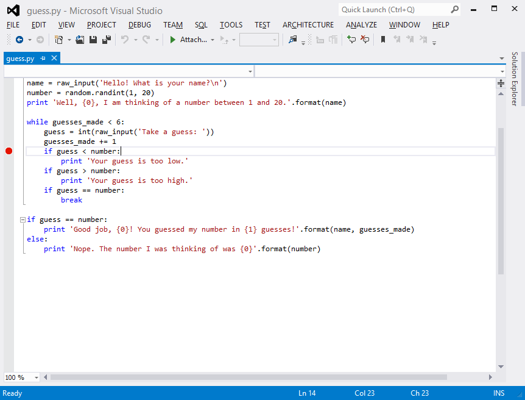
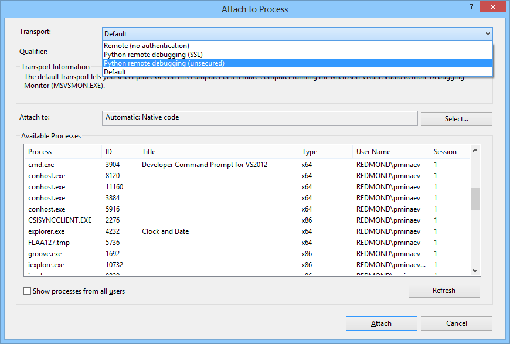
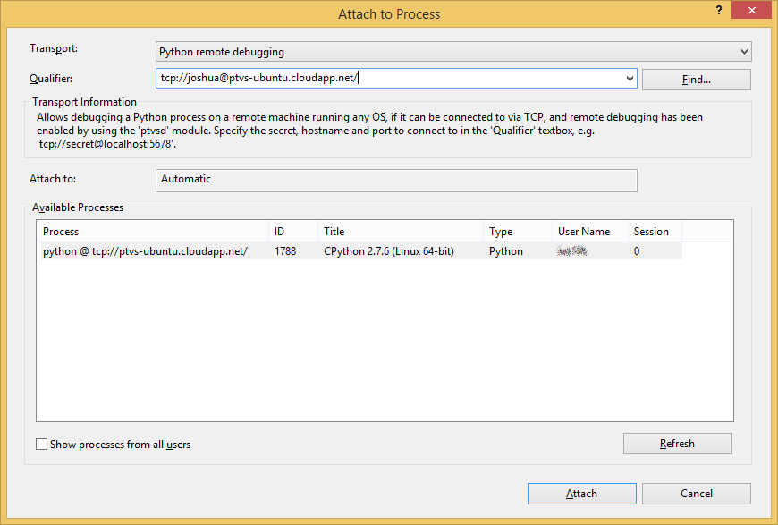
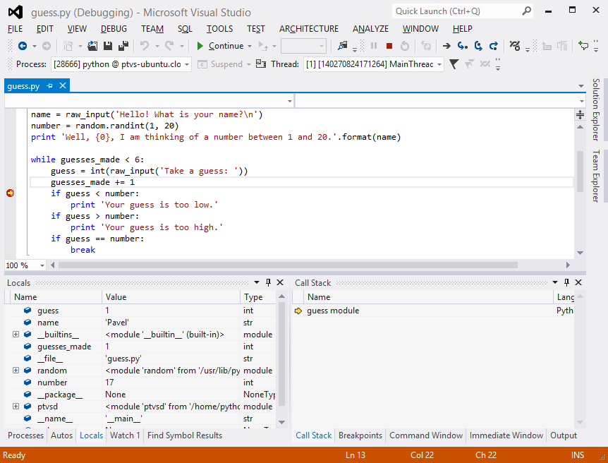
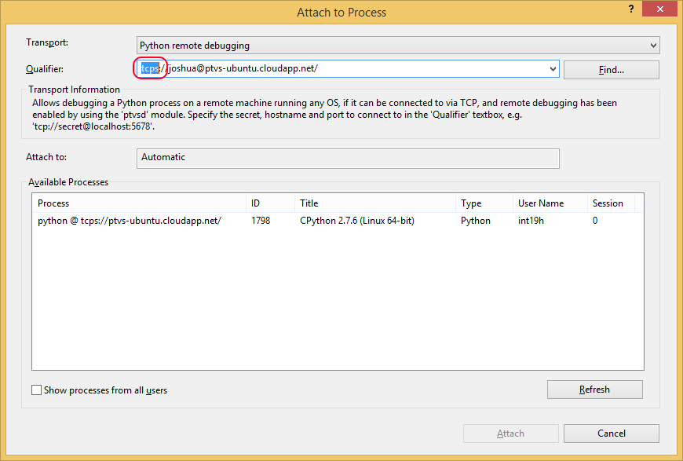
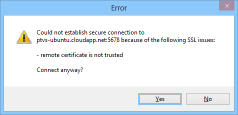

Cross-platform Remote Debugging
===============================

<p style="text-align: center">For a quick overview of Remote Debugging, please watch the video:</p>
[video:"Remote Debugging for Windows, Linux and OS X" VTluEosS4Ts]


Overview
--------

Python Tools already provides a number of facilities to debug apps launched from the IDE itself, as well as attaching to existing Python processes on both local and remote machines. However, these all only work if the process being debugged is running on a Windows PC, and attaching remotely also requires the [Visual Studio Remote Debugging Monitor](http://msdn.microsoft.com/en-us/library/xf8k2h6a.aspx) (MSVSMon) to be running on the remote PC. For situations when your app is running on a different operating system, such as Linux or OS X, or when you do not have permissions to install or run MSVSMon on a Windows machine, Python Tools 2.0 adds an alternative remote debugging option that does not require any separate processes, and runs on any OS capable of running Python itself. 

In this mode, the Python script being debugged also hosts the debug server to which the IDE then attaches over TCP. Consequently, it requires the source code of your script to be modified to import the debug server package and launch the server.


Preparing the script for debugging
----------------------------------


The following Python script will be used for demonstration purposes (taken without modifications from the Python wiki):

```python
import random

guesses_made = 0
name = raw_input('Hello! What is your name?\n')
number = random.randint(1, 20)
print 'Well, {0}, I am thinking of a number between 1 and 20.'.format(name)

while guesses_made < 6:
    guess = int(raw_input('Take a guess: '))
    guesses_made += 1
    if guess < number:
        print 'Your guess is too low.'
    if guess > number:
        print 'Your guess is too high.'
    if guess == number:
        break
if guess == number:
    print 'Good job, {0}! You guessed my number in {1} guesses!'.format(name, guesses_made)
else:
    print 'Nope. The number I was thinking of was {0}'.format(number)
```
 
Python Tools debug server is contained in the ptvsd package that comes with Python Tools. The easiest way to obtain it is by installing it from [PyPI](https://pypi.python.org/pypi/ptvsd) - e.g. with PIP, use `pip install ptvsd`. Alternatively, it can be located on the machine where Python Tools is installed, and manually copied over to the remote machine such that it can be imported from the script to be debugged. The folder containing the package can be located on the local machine using the shortcut available under the Python Tools group in the Start Menu.

After the package is made available for import on the remote machine, the script needs to have the following two lines of code added to enable remote debugging: 

```python
import ptvsd
ptvsd.enable_attach(secret = 'joshua')
```

Preferably, these lines should be inserted at the first line of the script, so that they are executed before any other code in it. It is not a strict requirement, but it will be impossible to debug any background threads spawned before enable_attach function is invoked. 

The `secret` parameter passed to `enable_attach` is used to prevent random people from connecting to the running script – it will have to be specified in Visual Studio when connecting, and connections will only be permitted when the specified secret matches the one used by the script. If you wish to disable this, and allow anyone to connect, you should use `enable_attach(secret=None)`. 

After making the necessary edits, start the script. Note that `enable_attach` call does not block – the debug server is launched on the background thread and awaits incoming connections, while your program continues to run. Another function in the same package, `wait_for_attach`, can be called after `enable_attach` to block program execution until the debugger attaches in cases where that is desired.

In addition to the two functions mentioned above, ptvsd also provides a helper function `break_into_debugger`, which serves as a programmatic breakpoint. This can be useful when you need a breakpoint to be triggered only when some complicated condition is true.


Attaching remotely from Python Tools
------------------------------------

The most common scenario for remote debugging is to set a breakpoint in the source and run the script until that breakpoint is hit. Note that you will need a local copy of the source file being debugged on the machine running Python Tools. It does not matter where the file is located, but its name should match the name of the actual script on the remote machine that will be attached to: 



Attaching is done using <span class="menu">Debug</span> → <span class="menu">Attach to Process</span> menu command, which opens the “Attach to Process” dialog. The first thing to do in it is to open the “Transport” combo box, and change selection to “Python remote debugging”: 



After that, the “Qualifier” textbox and the “Available Processes” list will be blank, and “Transport information” will provide a brief reminder of the steps necessary to set up remote debugging. Now, type the address of the remote machine, prefixed with the secret that was defined in the script, into the “Qualifier” textbox, and press Enter: 



At this point, Python Tools will try to connect to the debug server on the remote machine and obtain various process information from it to display in the “Available Processes” list. If some error occurs (e.g. a connection could not be established, or the secret did not match), an error message will be shown. One of the typical causes of error is that the remote machine is behind a firewall that does not have the debug server port (default is 5678) open. The workaround is to open the port, or, if it is not possible, to use a different port; the latter can be done by explicitly specifying it in the call to `enable_attach` in the `address` parameter, e.g.:

```python
ptvsd.enable_attach(secret = 'joshua', address = ('0.0.0.0', 8080))
```

Address format is the same as the one used by the standard Python module socket for sockets of type AF_INET; see its [documentation](http://docs.python.org/3/library/socket.html#socket-families) for details. 

Once the process appears in the list, it can be double-clicked to attach to it. Visual Studio changes into the debugging perspective, while the script continues to run. Enter some number to hit the breakpoint: 



From there on, you can use all the usual debugging features offered by Python Tools. 

If you stop debugging, Visual Studio detaches from your script, but it continues running. The debug server continues running on a background thread, as well, so you can re-attach to the script later using the same procedure.


Securing the debugger connection with SSL
-----------------------------------------

By default, the connection to the Python Tools remote debug server is not secured in any way – any person that knows the secret can connect, and all data is passed in plaintext. Consequently, it is possible for someone else on the network to snoop on data on the wire (which may contain e.g. values of variables in the debug script), or even execute a MITM attack. To prevent this when debugging over unsecured networks or Internet, the debug server supports SSL. 

To secure the channel with SSL, you need to have an SSL certificate. The easiest way to obtain one is to generate a self-signed certificate yourself, as [described](http://docs.python.org/3/library/ssl.html#self-signed-certificates) in the documentation for Python standard module `ssl`. To prevent MITM attacks, such a generated certificate will also have to be added to the CA root store on the Windows machine running Python Tools. This can be done using the Certificate Manager (certmgr.msc) as described [here](http://windows.microsoft.com/en-us/windows7/import-or-export-certificates-and-private-keys). Note that you will need to have a separate certificate file (not combined with the private key in a single file) to import. 

After you have the certificate and the private key files generated and registered, you will need to update the call to `enable_attach` in your script to use them. This is done by means of `certfile` and `keyfile` parameters, which have the same meaning as for the standard Python function `ssl.wrap_socket`. For example, if the certificate file is called joshua.cer, and the key file is called joshua.key, use: 

```python
ptvsd.enable_attach(secret = 'joshua', certfile = 'joshua.cer', keyfile = 'joshua.key')
```

The attach process is exactly the same as described earlier, except that, instead of using the **tcp://** scheme in the Qualifier, you use **tcps://**: 



If you did not add the certificate to the CA root store, you will get a warning message: 



You may choose to ignore this and proceed with debugging – the channel will still be encrypted against eavesdropping, but ignoring the warning opens you to a possibility of a MITM attack if someone is monitoring and intercepting your initial connection attempt.
