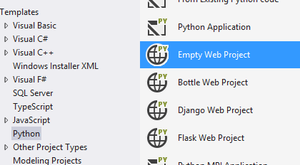
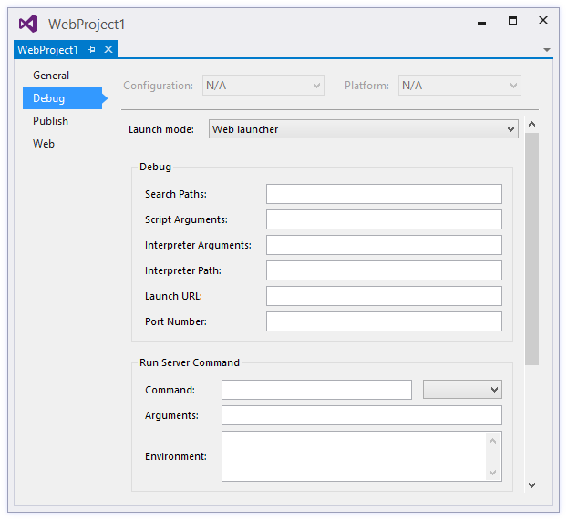
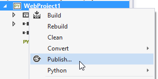
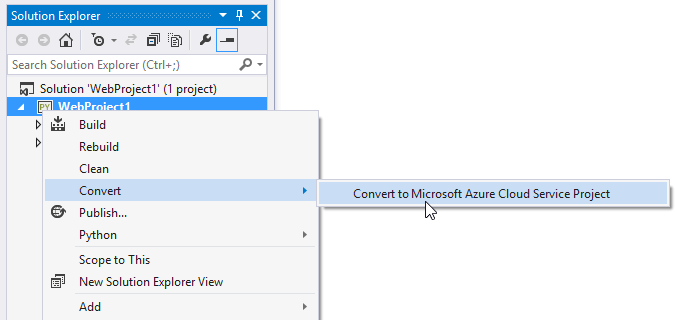

Python Web Projects
===================

Python Tools for Visual Studio includes support for developing web projects in frameworks such as Django and Flask.
This support includes a set of templates and a debug launcher that can be configured to handle various frameworks.
Templates for Bottle, Django and Flask are included.

*Note:* The web frameworks themselves are not included and require an internet connection to obtain.
You can install these packages into your active environment by right-clicking the project, selecting "Python" and the "Install/upgrade" framework command.

Templates
---------

New project templates are provided for the Bottle, Django, and Flask frameworks. These templates can be found in the New Project dialog:

These templates are preconfigured to launch as a web server with an randomly selected local port, to open your default browser when debugging, and to allow direct publishing to [Microsoft Azure](http://www.azure.com).
These changes are also available in the generic "Empty Web Project" template, which can be used for other frameworks, such as Pyramid.

Other than the generic one, each template includes a basic web server with a "hello, world" message.
This code is enough to run and debug the server locally (where some settings need to be obtained from the environment) and to deploy to Microsoft Azure (where a [WSGI app](http://www.python.org/dev/peps/pep-3333/) object needs to be provided).

When deploying to Azure, use of a virtual environment based on 32-bit Python 2.7 is recommended to ensure the deployed app has the same libraries as when run locally.
Azure does not currently support installing packages from a `REQUIREMENTS.TXT` file or selecting an alternative Python version.

As a convenience, the templates that are associated with a web framework include a command under the Project menu (and the project item's context menu in Solution Explorer) to install or upgrade to the latest version of the framework.
A specific version can be installed using the [wiki:"regular pip support" Python Environments#project-environments] and specifying a `name==version` package spec.

Debugging
---------

Web projects can be started for debugging by clicking the Play button on the toolbar

### Configuring local debugging

The Web launcher provides the functionality to start the web server and open your browser.
The generic template is configured to use the Web launcher, but some options are unspecified.

The first four properties in the **Debug** group are the same as for [wiki:"normal debugging" Features Debugging].
"Launch URL" specifies the URL that will be opened in your browser.
If no port number is specified in this URL, the port in "Port Number" will be used.
"Port Number" allow you to override the default value of the `SERVER_PORT` environment variable, which is used by the templates to configure the port the local debug server listens on.
By default, "Launch URL" is `localhost` and "Port Number" is automatically selected on each launch.

The properties in the **Run Server Command** group and **Debug Server Command** group (not shown in the image) determine how the web server is launched.
Since many frameworks require the use of a script outside of the current project, the script can be configured here and the name of the startup module can be passed as a parameter.
"Command" can be a Python script (`*.py` file), a module name (as in, `python.exe -m module_name`), or a single line of code (as in, `python.exe -c "code"`).
The value in the dropdown indicates which of these types is intended.

"Arguments" are passed on the command line following the command.
Any project property or environment variable can be specified with MSBuild syntax, for example: `$(StartupFile) --port $(SERVER_PORT)`.
`$(StartupFile)` is the relative path to the startup file.
`$(SERVER_HOST)` and `$(SERVER_PORT)` are normal environment variables that are set by the "Launch URL" and "Port Number" properties, automatically, or by the "Environment" property.

**Note:** There is a [issue:"known issue" 2322] with PTVS 2.1 Beta that prevents the use of `$(StartupModule)` and `$(StartupPath)` in this property.

The "Environment" property is a newline-separated list of `NAME=VALUE` pairs specifying environment variables.
These are set after all properties that may modify the environment, such as "Port Number" and search paths, and so may overwrite these values.

The values in the **Debug Server Command** group are used when starting with F5 or the "Start Debug Server" command.
Values in **Run Server Command** are used when starting with Ctrl+F5 or the "Start Server" command.

### Sample Configurations

These are some examples of the configuration settings used for various frameworks.

#### Bottle

When creating a Bottle app from the Bottle Web Project template, boilerplate code is included to avoid needing any configuration.
However, an imported bottle app may not include this code.
These settings will launch the app using the installed `bottle` module.

**Run Server**

* Command: `bottle` (module)
* Arguments: `--bind=%SERVER_HOST%:%SERVER_PORT% {StartupModule}:app`

**Debug Server**

* Command: `bottle` (module)
* Arguments: `--debug --bind=%SERVER_HOST%:%SERVER_PORT% {StartupModule}:app`

(The `--reload` option is not recommended when using PTVS for debugging.)

#### Pyramid

Pyramid apps are currently best created using the `pcreate` command-line tool.
However, once an app has been created, it can be imported using New Project from Existing Code.
Selecting the "Generic Web Project" customization will allow you to configure these options after importing.
Remember that you will likely need to configure the Working Directory property of your project as well, since Pyramid apps are typically one directory level deeper than other apps.

These settings assume that Pyramid is installed into a virtual environment at "..\env".

**Debug Properties**

* Server Port: 6543 (or whatever is configured in the .ini files)

**Run Server**

* Command: `..\env\scripts\pserve-script.py` (script)
* Arguments: `Production.ini`

**Debug Server**

* Command: `..\env\scripts\pserve-script.py` (script)
* Arguments: `Development.ini`

#### Others

If you have settings for another framework that you would like to share, or if you'd like to request settings for another framework, visit our [discussions page](https://pytools.codeplex.com/discussions) and start a post.

Publishing to Microsoft Azure
-----------------------------

Web projects can be published in a variety of ways.
Deployment from source control can be used in the same way as for other languages.
See the [Azure documentation](http://azure.microsoft.com/en-us/documentation/articles/web-sites-publish-source-control/) for information on source control deployment.

Deploying to an Azure Web Site or Cloud Service requires the [Azure SDK Tools for VS 2013](http://go.microsoft.com/fwlink/p/?linkid=323510) (or for [VS 2012](http://go.microsoft.com/fwlink/p/?linkid=323511)), obtainable through the [Web Platform Installer](http://www.microsoft.com/web/downloads/platform.aspx).
With these tools installed, Python projects will display a Publish command in the Project menu:

The "Publish" command will deploy your site to an Azure Web Site.
After selecting the command, a wizard will walk you through creating a web site or importing publish settings, previewing modified files, and publishing to a remote server.

See the [documentation on Azure.com](http://azure.microsoft.com/en-us/documentation/services/web-sites/#python) for more information on creating and deploying to Web Sites.

The "Convert to Windows Azure Cloud Service Project" command will add a Cloud Service project to your solution.
This project includes the deployment settings and configuration for the virtual machines and services to be used.
You should use the Publish command on the cloud project to deploy to Cloud Service; the Publish command on the Python project will still deploy to Web Sites.

See our [wiki:"Cloud Service Projects" Features Cloud Project] page for more information on Microsoft Azure Cloud Service.

