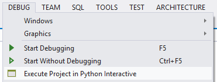
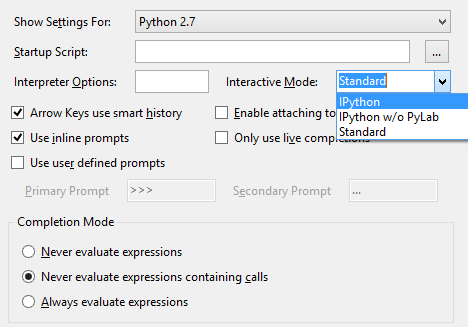
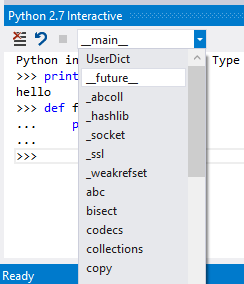
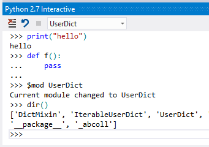
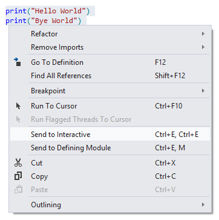
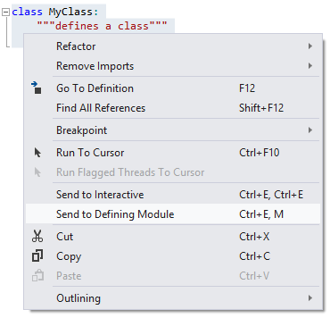

Working with the Interactive Window
===================================

Python Tools for Visual Studio includes an interactive window for developing your code - commonly called a REPL (Read/Evaluate/Print/Loop). The interactive window supports executing files or the start file of your project. The text of the menu item will change depending on if you have a project opened or not. When in a project the command will be called "Execute Project in Python Interactive". When working with a loose set of files the command will be "Execute File in Python Interactive":

You can also bring up the interactive window without executing any code with the View->Other Windows->Python Interactive menu item (or Alt-I for the default interpreter), or via Tools->Python Tools->Python Interactive (the exact menu items will be different depending on which versions of Python you have installed). This opens the interactive window if it is not already open and sets focus on it. If you've previously used the interactive window for executing a script or for other interactive development, the contents will still be available for your perusal.

Beyond the built-in Interactive window, you can choose IPython as the main REPL. IPython is an advanced yet user-friendly interactive development environment that's cross-platform and has Interactive Parallel Computing features (discussed elsewhere). Assuming you've installed it, go to Tools/Options/Python Tools to select it:

Switching Scopes
----------------

The interactive window when initially started is in the scope for the main module. If you bring up the interactive window without starting a file, the module is empty. If you start a file or your project, the module contents is the starting file, as if you ran it from the command prompt. You can also view other scopes which contain user code and switch amongst them to execute code within those modules. For example, after typing "import os" a number of modules execute, and you can now switch between them using the File Scope drop down. 

Selecting a module changes the current scope, and input now executes in that module. Whenever you perform any actions such as switching scopes, a log message is written to the output window, so you can keep track of how you got to a certain state during your development. 

The interactive window also supports several meta commands. All meta commands start with a $, and you can type $ or $help to get a list of the meta commands. The most useful meta command is probably the command that switches between modules without using the drop down box. This command is the $mod command and is followed by the module name you'd like to switch to. Other commands include clearing the screen, running a file which can include $ commands as well, or resetting the interactive process. The commands are also extensible via MEF (the Managed Extensibility Framework for .NET).

The interactive window includes intellisense based on the live objects rather than by analyzing the source code. This differs from the editor buffers of .py files in that analysis of the code in the REPL window is not necessary. The benefits are that you always get good completion. The drawback here is that functions which have side effects may impact your development experience. To control this behavior there are few different options in the Tools->Options->Editor->Python->Advanced menu. Here you can choose to never evaluate expressions, never evaluate expressions containing calls, or always evaluate expressions. In the never evaluate expressions mode the normal intellisense engine will be used for discovering possible completions. In the never evaluate expressions containing calls simple expressions such as "a.b" will be evaluated but expressions involving calls, such as "a.b()", will use the normal intellisense engine. The idea here is that simple member accesses are unlikely to have side effects. Finally always evaluate expressions will execute the expression to get completion information regardless of the expression.

<a id="SendTo" />
Sending Code to Interactive
---------------------------

In addition to working within the interactive window there are commands available that send selected code from the editor to the interactive window. This lets you work within the interactive window, update code in the editor, and then quickly send the updated code to the interactive window. 

In addition to simply sending the code to the current scope in the interactive window there is also a separate command which sends the code to the defining module. This command will search the interactive process to find the module that matches the current file being edited. If the command finds the correct module, then it uses the $module command to switch to that module. The $module command becomes part of the history of the interactive window so that the interactive buffer remains as a comprehensive history of everything you've done. Then the command pastes the selection into the interactive window for evaluation. 

The end result of this in the interactive window is indistinguishable from if you had manually switched to the correct scope and pasted the text yourself.

