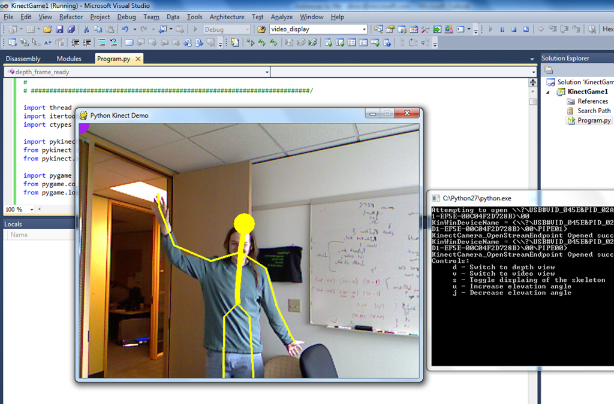
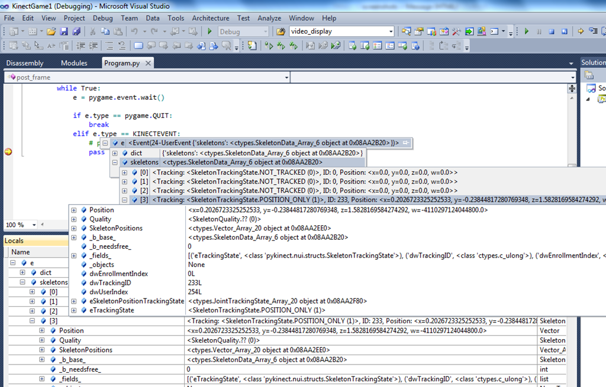
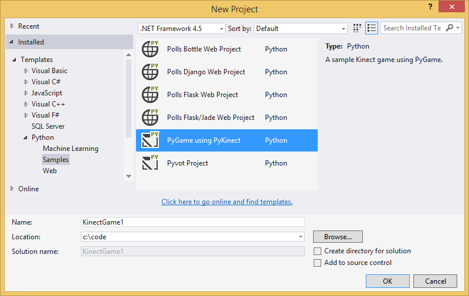
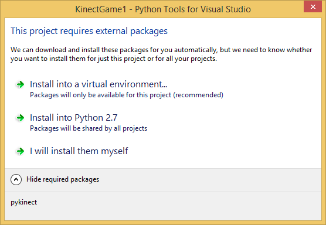
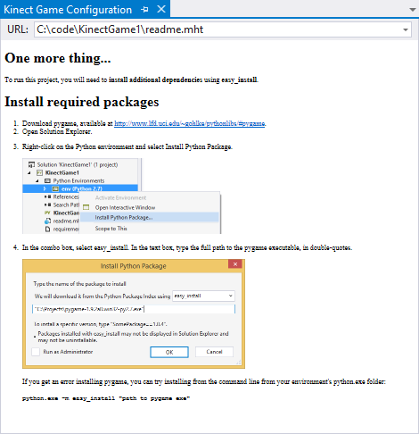
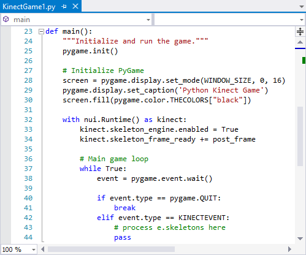

PyKinect - write Kinect games using Python!
===========================================

PyKinect enables writing awesome games and interfaces using Python:



Set breakpoints & Explore Kinect sensor data in the debugger directly:




Prerequisites
-------------

- CPython 2.7 32-bit
- Pygame: [http://www.pygame.org/download.shtml](http://www.pygame.org/download.shtml)
- Kinect SDK 32-bit: [http://kinectforwindows.org/](http://kinectforwindows.org/)
- Speech Support: [http://go.microsoft.com/fwlink/?LinkId=220942](http://go.microsoft.com/fwlink/?LinkId=220942)
- A kinect sensor (note you don't need an Xbox 360 to use PyKinect) 
- A kinect Power/USB Adaptor: [Sample from Amazon.com](http://www.amazon.com/Xbox-360-Kinect-Adapter-Power-Supply/dp/B004IXRXGY/ref=sr_1_1?ie=UTF8&qid=1320181429&sr=8-1)

PyKinect itself doesn't depend on Pygame - you can write games without it.  However, our samples do.  We use it because Pygame is awesome & popular.


Installation
------------

PyKinect is a Python package available from [PyPI](https://pypi.python.org/pypi/pykinect/).

You can install it in your CPython 2.7 32-bit environment using:

```
pip install pykinect
```

If you use PTVS with the Visual Studio sample project template, it will prompt to install PyKinect for you at project creation.

The Visual Studio sample project template for PyKinect is available as part of the PTVS Samples 2.1.vsix.  Download it from the [PTVS downloads page](https://pytools.codeplex.com/releases).

Don't forget to also install Pygame and the Kinect SDK.


Sample Project
--------------

To create a sample project, select File, New, Project, then under Python, Samples, choose **PyGame using PyKinect**.



You'll have the option of installing PyKinect in a new virtual environment, your global Python 2.7 environment or skip installation.



When the project finishes loading, it will display instructions for installing Pygame. You can skip that if you are using your global Python 2.7 with Pygame already installed.



The sample code basically sets up the event loop & does basic skeleton tracking.



For a slightly more involved sample, please see [PyGameDemo.py](https://hg01.codeplex.com/pytools/raw-file/76d5a3d3bf67/Release/Product/Python/PyKinect/PyKinect/PyGameDemo.py).

This sample renders the skeletons with the video or depth cameras.  When you run this sample, it opens a console window & prints the available keyboard commands.


Notes
-----

A couple of things to watch out for:

- Currently only 32-bit flavor of CPython is supported (ie, don't install it with a 64-bit Python interpreter even if PTVS allows it)
- If you are not getting skeleton tracking: make sure your body is within the sensor's range & your legs are visible to the camera.
- Sometimes the Pygame event queue can be overfilled - if this happens an exception is raised and can be handled appropriately.

If you develop a game or a sample that you're willing to share, please let us know!  We'd love to see what you've come up with & we can feature it here.
