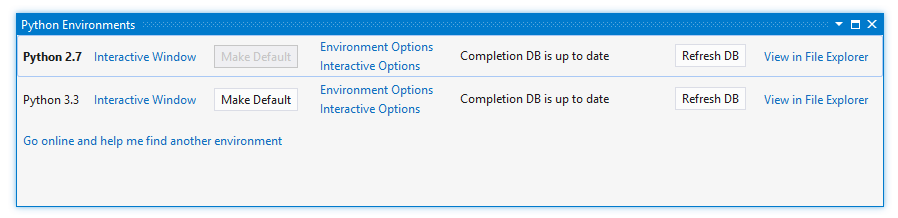
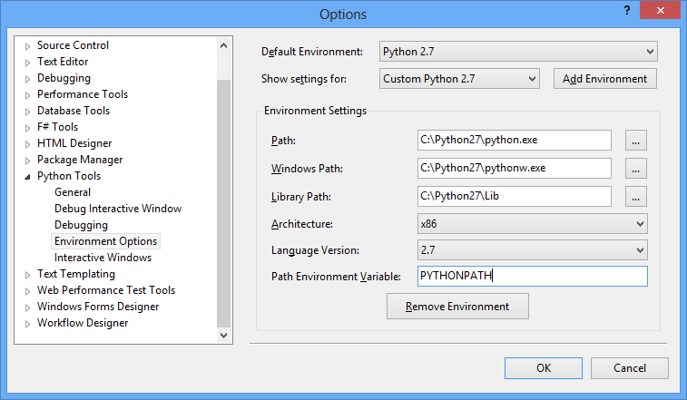
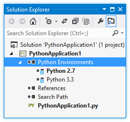
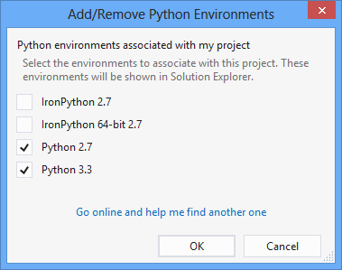
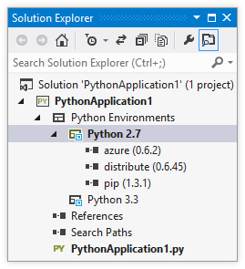
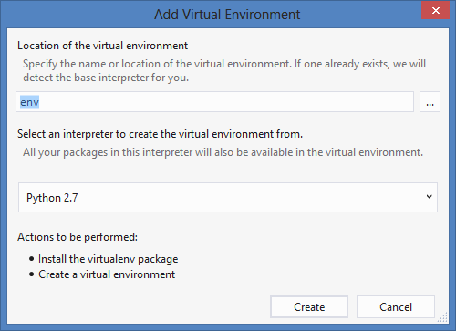
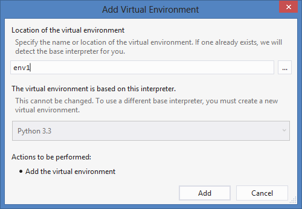

Python Environments
===================

Python comes in many different versions and varieties, such as the various versions of CPython, IronPython for targeting .NET, Jython for the JVM, PyPy for high performance applications, as well as distributions that bundle pre-built packages. While many people never need to use more than one, developers often use multiple Python environments.

Python Tools for Visual Studio provides features to help manage multiple Python environments. This page will provide an overview of these features and how to use them effectively.

The Python Environment
----------------------

A Python environment consists of an interpreter, a library, and a set of installed packages. When you download and install Python, you will get an environment for a particular platform, such as CPython or IronPython, and a particular version, such as 2.7 or 3.3. These determine which language constructs and syntax are valid, and what OS-level functionality you can access. They will also affect which packages you can use, as most packages are designed for particular environments.

In most cases, the library included will be the Python Standard Library, though potentially limited or augmented depending on what the platform supports. Many downloads will also include packages, which are not part of the standard library (yet), but provide useful functionality. You can also download and install packages into an existing environment whenever you like.

When running a Python script, it must run against a particular environment. Generally, this is determined by the location of the executable used to start it. Because Python Tools for Visual Studio does not require you to type 'python.exe' every time, this option is exposed in a different manner.

Global Environments
-------------------

A global (or system-wide) environment is one that is installed on your PC and is available to all of your projects. These are usually installed to your C:\ drive or Program Files, and are automatically detected when Python Tools is running or when it is started. Global environments can be viewed in the Python Environments window (Ctrl+K, ` - Control + K, backtick):

This image shows two environments: Python 2.7 is the current default, which means that all new projects will use it for executing, debugging, checking syntax, displaying import and member completions, and any other tasks that require an environment. Changing the default environment will affect all projects that have not had a [project environment](#projectenvironments "Project Environments") added.

The other links available in this widow allow you to quickly access the Interactive Window or change options associated with the environment. See [wiki:"Editing" Features Editor] for a discussion of the Refresh DB command.

New environments are typically discovered automatically when you install them onto your machine. However, for one reason or another, not every environment can be found. To add a global environment manually, you can open Environment Options from anywhere in the Python Environments window (or through Tools, Options, Python Tools) and click 'Add Environment'.

This image shows typical values for Python distributions based on CPython 2.7. Once added, this environment will behave just like one that was automatically detected.

For those with only one Python environment, there is little need to continue reading, especially if it already includes a large number of useful packages. However, for those who are writing Python code to be run in multiple environments or have a need for certain, specific packages, global environments are unlikely to be satisfactory.

Project Environments
--------------------

--(

>>

Global environments are limited in that only one can be made the default at any time, and this will be active for all projects. Depending on the project, not all environments may apply. For example, a project that requires IronPython might not work if the global default environment is CPython. By specifying project environments, you can ensure that your project will always be run in a supported environment - the global default is ignored.

Project environments are listed in Solution Explorer under the Python Environments node. The bold entry is currently active, and will be used for debugging, import and member completions, syntax checking, and any other tasks that require an environment. Another entry can be selected and activated by right-clicking and choosing 'Activate Environment'. The current active environment is saved in the project file and will be stored across sessions.

--)

--(

>>

Any global environment can be added as a project environment by right-clicking the 'Python Environments' entry and selecting 'Add/Remove Python Environments...'. This will display a list of the known environments and let you select or deselect those that should be available in your project.

Once an environment is displayed in Solution Explorer, it can be expanded to display the installed packages. These packages are not part of the Python standard library but can be imported and used in your code when the environment is active.

New packages can be installed by right-clicking the environment entry ('Python 2.7' in the image below) and selecting 'Install Python Package'. Packages are downloaded from the Python Package Index (PyPI) by specifying the name of the package - visit [https://pypi.python.org/pypi](https://pypi.python.org/pypi) to search available packages. Once installed, a package can be uninstalled by right-clicking it and selecting 'Remove'. Success or failure is shown in the status bar and the output window, along with the full output from the package manager used to do the installation.

--)

--(

**NOTE:** Python's package management support is currently under development by the core Python development team. The displayed entries may not always be accurate, and installation and uninstallation may not be reliable or available. Python Tools will use the pip package manager if available, and will download and install it when required. The easy_install package manager is also available to install packages that pip cannot. Packages installed with these tools from the command-line will also be displayed in Python Tools.

One common situation where pip will fail to install a package is when the package include source code for native components. Without the required version of Visual Studio installed (typically VS 2008 for Python versions earlier than 3.3), pip will not be able to compile these components. The error message displayed in this situation is `error: Unable to find vcvarsall.bat.` easy_install is often able to download pre-compiled binaries.

--)

Virtual Environments
--------------------

Because packages installed into a global environment are available to all projects that use it, conflicts may occur. For example, two projects may require incompatible packages or different versions of the same package. To avoid this issue, projects that require particular packages should use a virtual environment.

Like any other Python environment, a virtual environment consists of a Python interpreter, a library and a set of packages. However, the interpreter and library are actually shared with a base interpreter, which you can select from your global environments. This minimizes the number of files in the virtual environment, making it not much bigger than the packages that are installed. In effect, a virtual environment is like having a private folder of packages in your project.

To create a virtual environment, right-click the Python Environments item in Solution Explorer and select 'Add Virtual Environment...'.

Specify a name to create the virtual environment in your project path, or a full path to create it elsewhere. Environment names should be letters and numbers only to ensure maximum compatibility with other tools. Select a global environment to act as the base interpreter (you cannot use another virtual environment for this), and click 'Create'. If pip or the virtualenv package are not available, they will be downloaded and installed.

If the provided path is an existing virtual environment, the base interpreter will be detected and the create button will change to 'Add':

Alternatively, an existing virtual environment can be added by right-clicking the Python Environments item in Solution Explorer and selecting 'Add Existing Virtual Environment...'. We will detect the base interpreter automatically from the orig-prefix.txt file in the environment's lib directory.

Once a virtual environment is added to your project, it can be activated like any other environment, and packages can be installed or uninstalled. Right-clicking it and selecting 'Remove' will allow you to either remove the reference to the environment, or delete the environment and all the files on disk.

RC Caveats
==========
* Changing the active environment may cause VS to freeze briefly as the IntelliSense database is loaded. Environments with lots of packages may freeze for longer.
* While the system-site-packages option will be respected, there is no way to set or change this from within VS.
